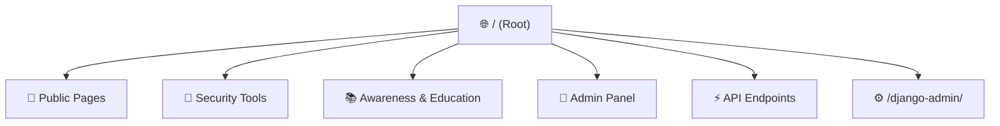
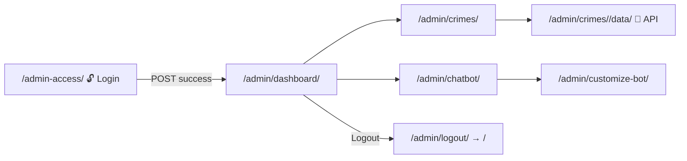
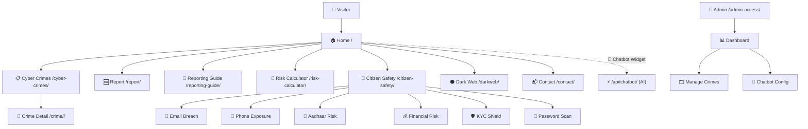

# 🛡️ CyberSafe Portal — Site Map

> Django app: `main` · Project: `cysafe_project` · Base template: [templates/base.html](file:///c:/Users/omkar/Downloads/Deepcytes/Cybersafe_V1/templates/base.html)

---

## Architecture Overview



---

## 📄 Public Pages

| Route | URL | View | Template | Auth |
|-------|-----|------|----------|------|
| Home | `/` | [home](file:///c:/Users/omkar/Downloads/Deepcytes/Cybersafe_V1/main/views.py#45-57) | [main/home.html](file:///c:/Users/omkar/Downloads/Deepcytes/Cybersafe_V1/templates/main/home.html) | Public |
| Cyber Crimes Listing | `/cyber-crimes/` | [cyber_crimes](file:///c:/Users/omkar/Downloads/Deepcytes/Cybersafe_V1/main/views.py#59-98) | [main/cyber_crimes.html](file:///c:/Users/omkar/Downloads/Deepcytes/Cybersafe_V1/templates/main/cyber_crimes.html) | Public |
| Crime Detail | `/crime/<uuid>/` | [crime_detail](file:///c:/Users/omkar/Downloads/Deepcytes/Cybersafe_V1/main/views.py#100-111) | [main/crime_detail.html](file:///c:/Users/omkar/Downloads/Deepcytes/Cybersafe_V1/templates/main/crime_detail.html) | Public |
| Report a Crime | `/report/` | [report_crime](file:///c:/Users/omkar/Downloads/Deepcytes/Cybersafe_V1/main/views.py#113-121) | [main/report_crime.html](file:///c:/Users/omkar/Downloads/Deepcytes/Cybersafe_V1/templates/main/report_crime.html) | Public |
| Reporting Guide | `/reporting-guide/` | [reporting_guide](file:///c:/Users/omkar/Downloads/Deepcytes/Cybersafe_V1/main/views.py#123-126) | [main/reporting_guide.html](file:///c:/Users/omkar/Downloads/Deepcytes/Cybersafe_V1/templates/main/reporting_guide.html) | Public |
| Risk Calculator | `/risk-calculator/` | [risk_calculator](file:///c:/Users/omkar/Downloads/Deepcytes/Cybersafe_V1/main/views.py#128-131) | [main/risk_calculator.html](file:///c:/Users/omkar/Downloads/Deepcytes/Cybersafe_V1/templates/main/risk_calculator.html) | Public |
| Contact | `/contact/` | [contact](file:///c:/Users/omkar/Downloads/Deepcytes/Cybersafe_V1/main/views.py#133-136) | [main/contact.html](file:///c:/Users/omkar/Downloads/Deepcytes/Cybersafe_V1/templates/main/contact.html) | Public |
| Dark Web | `/darkweb/` | [dark_web](file:///c:/Users/omkar/Downloads/Deepcytes/Cybersafe_V1/main/views.py#173-176) | [main/darkweb.html](file:///c:/Users/omkar/Downloads/Deepcytes/Cybersafe_V1/templates/main/darkweb.html) | Public |

---

## 🔧 Security Tools (Citizen Safety)

These tools live under the **Citizen Safety** section.

| Route | URL | View | Template | Auth |
|-------|-----|------|----------|------|
| Citizen Safety Hub | `/citizen-safety/` | [citizen_safety](file:///c:/Users/omkar/Downloads/Deepcytes/Cybersafe_V1/main/views.py#138-141) | [main/citizen_safety.html](file:///c:/Users/omkar/Downloads/Deepcytes/Cybersafe_V1/templates/main/citizen_safety.html) | Public |
| Email Breach Check | `/email-breach-check/` | [email_breach_check](file:///c:/Users/omkar/Downloads/Deepcytes/Cybersafe_V1/main/views.py#143-146) | [main/email_breach.html](file:///c:/Users/omkar/Downloads/Deepcytes/Cybersafe_V1/templates/main/email_breach.html) | Public |
| Phone Exposure Check | `/phone-exposure-check/` | [phone_exposure_check](file:///c:/Users/omkar/Downloads/Deepcytes/Cybersafe_V1/main/views.py#148-151) | [main/phone_exposure.html](file:///c:/Users/omkar/Downloads/Deepcytes/Cybersafe_V1/templates/main/phone_exposure.html) | Public |
| Aadhaar Risk Check | `/aadhaar-risk-check/` | [aadhaar_risk_check](file:///c:/Users/omkar/Downloads/Deepcytes/Cybersafe_V1/main/views.py#153-156) | [main/aadhaar_risk.html](file:///c:/Users/omkar/Downloads/Deepcytes/Cybersafe_V1/templates/main/aadhaar_risk.html) | Public |
| Financial Risk Scan | `/financial-risk-scan/` | [financial_risk_scan](file:///c:/Users/omkar/Downloads/Deepcytes/Cybersafe_V1/main/views.py#158-161) | [main/financial_risk.html](file:///c:/Users/omkar/Downloads/Deepcytes/Cybersafe_V1/templates/main/financial_risk.html) | Public |
| KYC Document Shield | `/kyc-document-shield/` | [kyc_document_shield](file:///c:/Users/omkar/Downloads/Deepcytes/Cybersafe_V1/main/views.py#163-166) | [main/kyc_shield.html](file:///c:/Users/omkar/Downloads/Deepcytes/Cybersafe_V1/templates/main/kyc_shield.html) | Public |
| Password Strength Scan | `/password-strength-scan/` | [password_strength_scan](file:///c:/Users/omkar/Downloads/Deepcytes/Cybersafe_V1/main/views.py#168-171) | [main/password_scan.html](file:///c:/Users/omkar/Downloads/Deepcytes/Cybersafe_V1/templates/main/password_scan.html) | Public |

---

## 🔐 Admin Panel

> All admin routes (except login) require `@login_required`.



| Route | URL | View | Template | Auth |
|-------|-----|------|----------|------|
| Admin Login | `/admin-access/` | [admin_login](file:///c:/Users/omkar/Downloads/Deepcytes/Cybersafe_V1/main/views.py#178-259) | [admin/login.html](file:///c:/Users/omkar/Downloads/Deepcytes/Cybersafe_V1/templates/admin/login.html) | Public |
| Admin Logout | `/admin/logout/` | [admin_logout](file:///c:/Users/omkar/Downloads/Deepcytes/Cybersafe_V1/main/views.py#261-270) | — (redirect) | `@login_required` |
| Admin Dashboard | `/admin/dashboard/` | [admin_dashboard](file:///c:/Users/omkar/Downloads/Deepcytes/Cybersafe_V1/main/views.py#272-290) | [admin/dashboard.html](file:///c:/Users/omkar/Downloads/Deepcytes/Cybersafe_V1/templates/admin/dashboard.html) | `@login_required` |
| Manage Crimes | `/admin/crimes/` | [admin_crimes](file:///c:/Users/omkar/Downloads/Deepcytes/Cybersafe_V1/main/views.py#292-539) | [admin/crimes.html](file:///c:/Users/omkar/Downloads/Deepcytes/Cybersafe_V1/templates/admin/crimes.html) | `@login_required` |
| Chatbot Management | `/admin/chatbot/` | [admin_chatbot](file:///c:/Users/omkar/Downloads/Deepcytes/Cybersafe_V1/main/views.py#619-667) | [admin/chatbot.html](file:///c:/Users/omkar/Downloads/Deepcytes/Cybersafe_V1/templates/admin/chatbot.html) | `@login_required` |
| Customize Bot | `/admin/customize-bot/` | [customize_bot](file:///c:/Users/omkar/Downloads/Deepcytes/Cybersafe_V1/main/views.py#839-864) | [admin/customize_bot.html](file:///c:/Users/omkar/Downloads/Deepcytes/Cybersafe_V1/templates/admin/customize_bot.html) | `@login_required` |
| Django Admin | `/django-admin/` | *(built-in)* | — | Superuser |

---

## ⚡ API Endpoints

| Route | Method | View | Auth | Purpose |
|-------|--------|------|------|---------|
| `/api/chatbot/` | `POST` | [chatbot_api](file:///c:/Users/omkar/Downloads/Deepcytes/Cybersafe_V1/main/views.py#669-820) | Public (rate-limited) | Sends user message → Gemini AI → response |
| `/api/increment-clicks/` | `POST` | [increment_clicks](file:///c:/Users/omkar/Downloads/Deepcytes/Cybersafe_V1/main/views.py#822-837) | Public | Increments `learn_more_clicks` on a crime |
| `/admin/crimes/<uuid>/data/` | `GET` | [crime_data_api](file:///c:/Users/omkar/Downloads/Deepcytes/Cybersafe_V1/main/views.py#541-614) | `@login_required` | Returns crime JSON for admin view/edit modal |

---

## 📁 Template Structure

```
templates/
├── base.html                      ← Shared layout (nav, footer, chatbot widget)
├── main/
│   ├── home.html                  ← Homepage + trending crimes + stats
│   ├── cyber_crimes.html          ← Paginated crimes listing + search/filter
│   ├── crime_detail.html          ← Individual crime detail page
│   ├── report_crime.html          ← Report a cybercrime form
│   ├── reporting_guide.html       ← Step-by-step reporting guide
│   ├── risk_calculator.html       ← Personal cyber risk assessment tool
│   ├── contact.html               ← Contact form / info
│   ├── citizen_safety.html        ← Safety tools hub
│   ├── email_breach.html          ← Email breach checker
│   ├── phone_exposure.html        ← Phone number exposure checker
│   ├── aadhaar_risk.html          ← Aadhaar ID risk checker
│   ├── financial_risk.html        ← Financial risk scanner
│   ├── kyc_shield.html            ← KYC document shield
│   ├── password_scan.html         ← Password strength scanner
│   └── darkweb.html               ← Dark web awareness page
└── admin/
    ├── login.html                 ← Admin login page
    ├── dashboard.html             ← Admin stats + recent activity
    ├── crimes.html                ← CRUD management for CyberCrime entries
    ├── chatbot.html               ← Chatbot testing interface + stats
    └── customize_bot.html         ← Edit system prompt + Gemini model/key
```

---

## 🗃️ Data Models (Key)

| Model | Purpose |
|-------|---------|
| `CyberCrime` | Crime entries with category, severity, tips, images |
| `AdminUser` | Custom admin user with login-attempt locking |
| `ChatbotConfig` | Gemini API key, model ID, system prompt |
| `ChatbotConversation` | Log of every chatbot interaction |
| `AuditLog` | Admin action audit trail |

---

## 🔄 User Flow Summary


